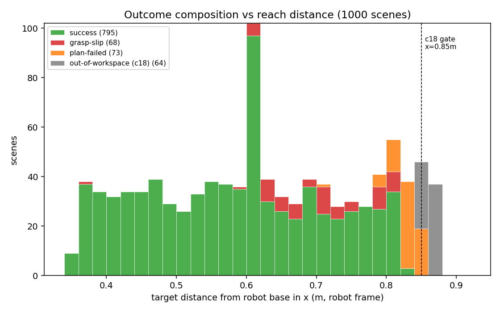
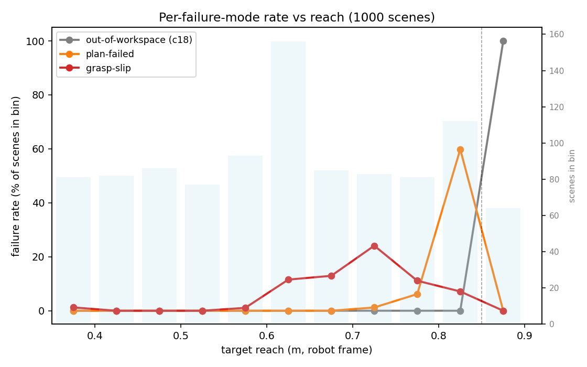
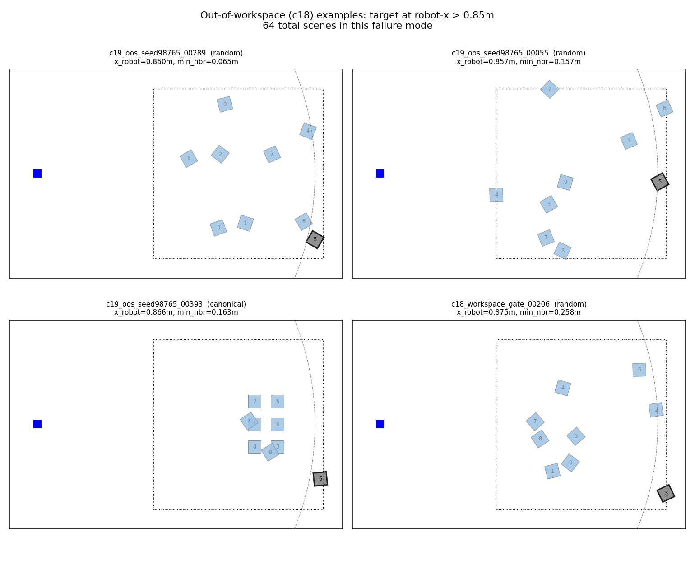
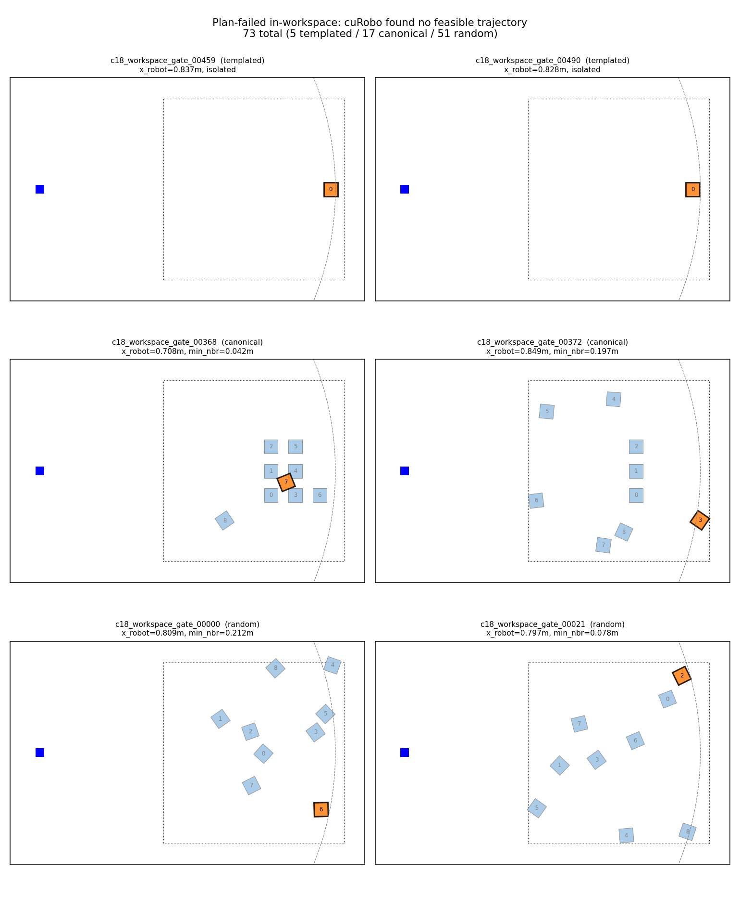
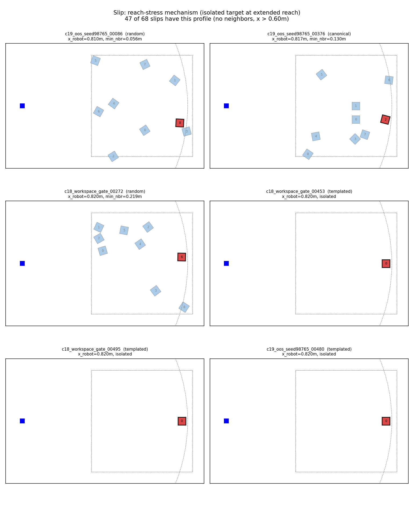
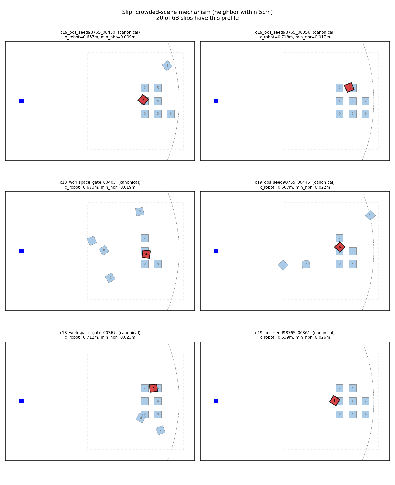
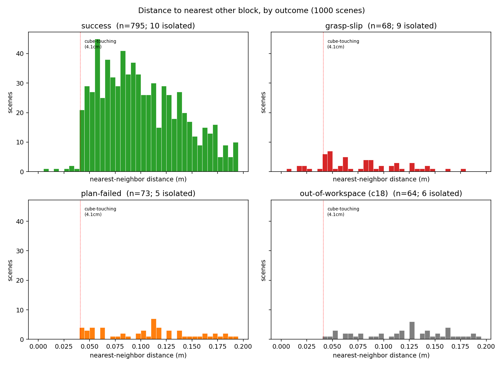
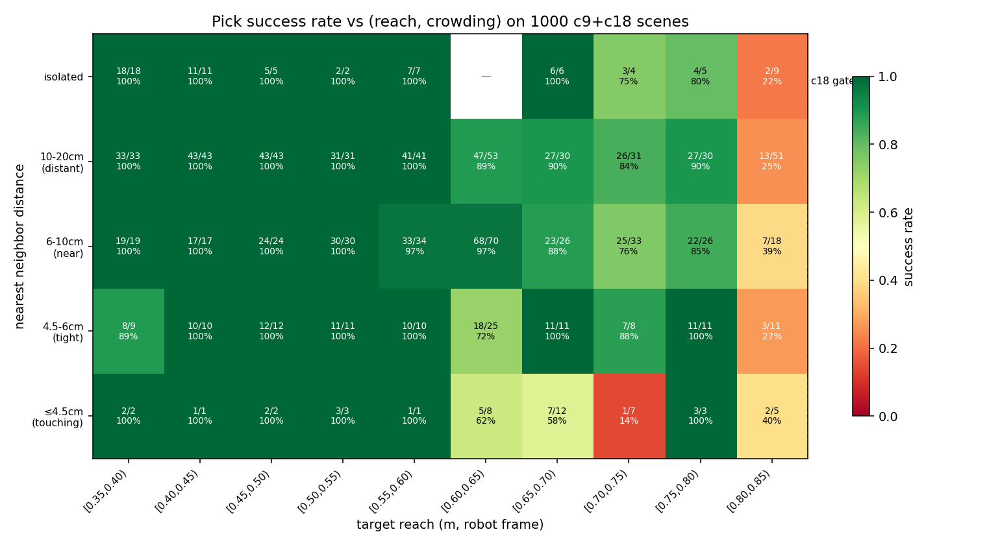
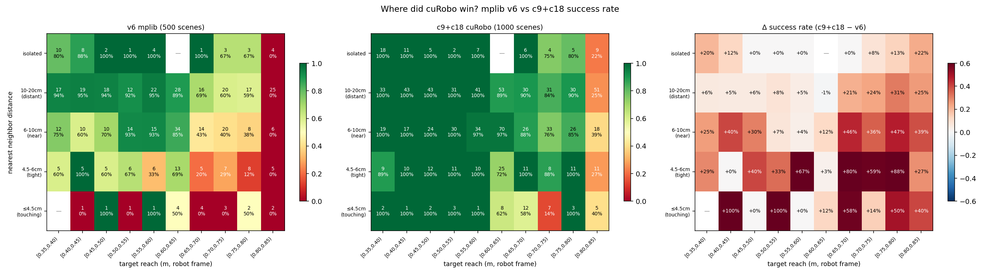
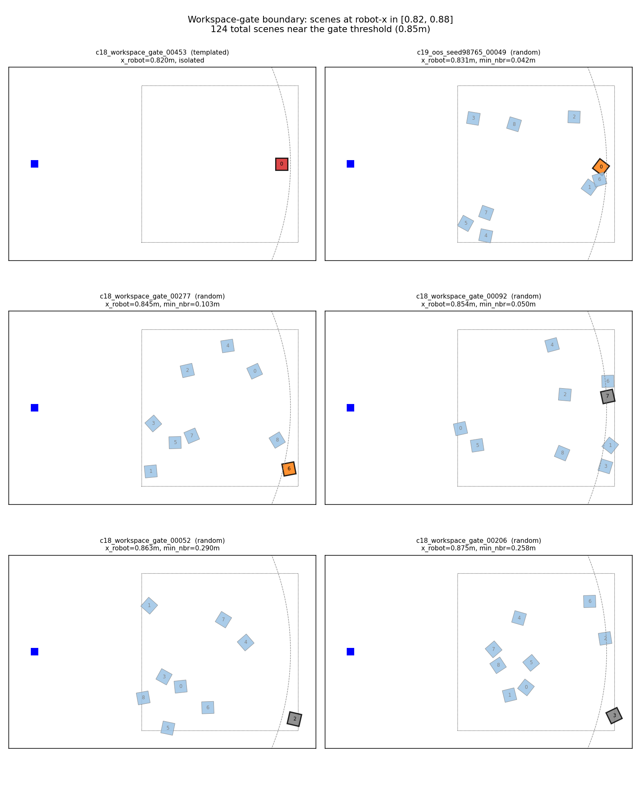

# c9 + c18 Controller — Failure-Mode Characterization

**Controller**: cuRobo `plan_grasp` with finger collisions kept on (c9) plus a
pre-planning workspace gate at robot-frame `x = 0.85 m` (c18). Single code
path in `taskbench/skills/primitives.py:Pick._call_curobo`.

**Data**: 1000 scenes total, combining

- `c18_workspace_gate.parquet` — in-sample, seed-set seed `12345` (500 scenes)
- `c19_oos_seed98765.parquet` — out-of-sample, seed-set seed `98765` (500 scenes)

The two evals agree to within sampling noise (80.4 % in-sample vs 78.6 % OOS,
≤ 3.5 pp 95 % CI on 500 binomials). Failure-mode shape is also stable across
the two — every bucket appears with the same relative weight in both. The
analysis below treats them as a single 1000-scene reference set.

**Source-of-truth artifacts**

- Figures: `outputs/controller_eval/analysis/figures/*.png`
- Per-scene records (one row per scene): `scene_records.csv` in this directory
- Reproduce: `uv run python scripts/analyze_failure_modes.py`

---

## 1. Headline

| | count | rate | confidence interval (95 %) |
|---|---:|---:|---:|
| **success** | 795 / 1000 | **79.5 %** | 76.9–81.9 % |
| out_of_workspace (c18 gate) | 64 | 6.4 % | — |
| grasp_plan_failed | 73 | 7.3 % | — |
| grasp_verification_failed (slip) | 68 | 6.8 % | — |
| reach / grasp_approach / lift | 0 | 0 % | — |

The three failure modes are roughly equal in size (~6–7 % each). They are
**mechanistically distinct** — different causes, different scenes, different
fixes — so the analysis treats them separately.

The 0-count "execution" buckets are important to note: **whenever cuRobo
returns a trajectory, executing it does not fail.** All remaining failures
are either upstream of execution (no plan) or downstream of it (the gripper
closes but doesn't end up holding the cube).

### Per source

| source | n | success | OOW | plan-fail | slip |
|---|---:|---:|---:|---:|---:|
| random | 700 | 80.6 % | 6.4 % | 7.3 % | 5.7 % |
| canonical | 200 | 78.0 % | 6.5 % | 8.5 % | 7.0 % |
| templated | 100 | 75.0 % | 6.0 % | 5.0 % | **14.0 %** |

Templated is mostly close to the mean except for the slip rate, which is
~2× higher. That's the `edge_target` archetype (single block at extended
reach) — see §4 for the mechanism.

---

## 2. The two structural axes

Two scene-level features explain almost all the variation between the
failure modes:

1. **Target reach** = distance from the Panda base in the robot-x direction.
   World-frame target_x + 0.615 m. Range 0.35 – 0.88 m in our seed-sets.
2. **Crowding** = number of other blocks within 5 cm of the target.

The figure below stacks the outcomes vs reach. The shape of the diagram
*is* the failure-mode story:

- Reach < 0.60 m: nearly all successes. No plan_fails. Very few slips.
- 0.60 – 0.80 m: slip rate climbs steadily. Plan-fail rate still near zero.
- 0.80 – 0.85 m: **plan_fail spike**. Slip flattens.
- > 0.85 m: c18 workspace gate fires — `out_of_workspace`.

The same data as failure *rates* per bin:

The three failure curves are non-overlapping in shape: each mode dominates
a different reach band. This is the structural finding of the analysis.

---

## 3. Failure modes

### 3.1 `out_of_workspace` — 64 scenes (6.4 %)

**Mechanism.** The c18 gate rejects scenes where `target_robot_x > 0.85 m`
before invoking cuRobo. The Panda's effective reach for a 4 cm cube is
~0.85 m — beyond that, IK either has no solution at all, or the solution
sits at a kinematic singularity that the controller cannot stabilize.

**Why the threshold is 0.85 m.** Without the gate, every scene at
`x > 0.85 m` returned `grasp_plan_failed` (cuRobo's IK gave up after 64
seeds × 72 candidates). The gate replaces ~2 s of wasted planning per
scene with a ~0 ms position check, with **zero impact on success count**.

**What these scenes look like.** Single blocks or grids placed near the
far edge of the workspace. Random scenes can drop a cube right against
`x = 0.26` (world frame), placing it 0.875 m from the base.

The grey square in each panel is the target. Notice all four are well
outside the dashed grey arc (the gate boundary).

**Edge cases — boundary scenes (x ∈ [0.82, 0.88]).** The current gate
threshold is actually *too lenient*. The boundary breakdown:

| bin | n | OOW | plan-fail | slip | success |
|---|---:|---:|---:|---:|---:|
| [0.82, 0.84) | 41 | 0 | 35 | 3 | **3** |
| [0.84, 0.85) | 19 | 0 | 19 | 0 | **0** |
| [0.85, 0.86) | 27 | 27 | 0 | 0 | 0 |
| [0.86, 0.88) | 37 | 37 | 0 | 0 | 0 |

The range `[0.84, 0.85)` contains 19 scenes — **all plan_fails, zero
successes**. Moving the gate from `0.85` → `0.84` would convert these
19 scenes from `plan_fail` (each costing ~2 s) to `out_of_workspace`
(each ~0 ms), saving ~38 s of planning time per 1000 scenes with zero
loss in success. Going further (gate at `0.82`) would only cost 3
successes for 38 more rejections — not worth it.

Recommended: **bump `TASKBENCH_WORKSPACE_X_MAX` to `0.84`**.

### 3.2 `grasp_plan_failed` — 73 scenes (7.3 %)

**Mechanism.** cuRobo's `plan_grasp` returned `None` — no IK + collision-
free trajectory exists among the 72 candidate grasp poses, even with
finger collisions disabled on the grasp segment. The planner is correctly
reporting "this scene has no feasible top-down grasp for this gripper".

**Sub-distribution by source.**

| source | plan_fails |
|---|---:|
| random | 51 (70 %) |
| canonical | 17 (23 %) |
| templated | 5 (7 %) |

Within each source the mechanism differs:

- **Random plan_fails are reach-induced**: the 51 random plan_fails skew
  heavily toward x ≥ 0.80 m. They're scenes where the cube is far enough
  out that the gripper *can't* approach top-down (joint 7 hits its limit)
  but the c18 gate hasn't yet rejected them.
- **Canonical plan_fails are geometry-induced**: 17 scenes where a
  partial pyramid mid-build leaves the target in a "slot" between
  neighbors. The gripper needs an angled approach that requires a
  joint config not reachable.
- **Templated plan_fails are ringed_target instances** at small radii:
  5 scenes where 4 obstacles ring the target at < 4.5 cm spacing. No
  top-down gripper width fits between them.

Top row: templated `edge_target` near the reach boundary — even though
isolated, the wrist can't quite get there. Middle row: canonical pyramid
mid-builds with the target in a slot. Bottom row: random scenes with
crowded targets *near* the workspace edge.

**Why this is not controller-fixable.** cuRobo has exhausted 64 IK seeds ×
8 trajopt seeds × 72 grasp candidates. The "no" is correct. A different
gripper (narrower fingers) or a non-top-down approach (side grasp) would
shift this number, but those are out-of-scope changes.

### 3.3 `grasp_verification_failed` — 68 scenes (6.8 %)

**Mechanism.** cuRobo found a plan, the trajectory executed without
collision, the gripper closed from open (1.0) to closed (−1.0), but
immediately afterward `agent.is_grasping(obj)` returned `False`. The
gripper finished in a state that does not symmetrically clamp the cube.

This is the most interesting bucket. It's the one we tried hardest to
reduce (8 experiments past c9, all null) and it splits cleanly into
two sub-mechanisms based on scene crowding:

#### 3.3.1 Reach-stress slip — 47 of 68 (69 %)

Filter: `nbrs_5 == 0` (isolated target) AND `tx_robot > 0.60 m`.

**Mechanism.** At extended reach the Panda arm is near-fully-extended.
The Jacobian is near-singular; *manipulability* (a measure of how easily
small Cartesian wrist motions can be made) collapses. When the gripper
fingers contact the cube during close, contact force transmits up through
the gripper-wrist-arm chain. The PD controller fights to hold the planned
wrist pose but in a low-manipulability config its correction is sluggish.
The wrist drifts by 1–3 mm during close. That drift breaks the symmetric
finger-cube contact: one finger arrives at the cube face before the other,
nudges the cube sideways, and by the time the second finger arrives the
cube has slipped past it.

We verified this mechanism is not controller-fixable: stiffer wrist PD
(c12, up to 10×), pre-close settling (c10), two-stage close (c11),
velocity feed-forward (c17), and tighter IK precision (c13) were all
nulls or marginal +1 to +2 in physics-sim noise.

Notice all six panels show a single red square (target) far to the
right, sitting near the reach arc, with no nearby neighbors. These
are the templated `edge_target` archetype at high sweep steps plus
random/canonical scenes where the target happens to land near the
reach edge.

The reach-rate curve (figure 3) confirms this: slip rate peaks at
~24 % in the `[0.70, 0.75) m` band, before plan-fail takes over.

#### 3.3.2 Crowded-scene slip — 20 of 68 (29 %)

Filter: `nbrs_5 ≥ 1` (at least one neighbor within 5 cm).

**Mechanism.** This is the failure mode that c9 *most* improved over c5
(which had no finger collisions) but didn't fully eliminate. With c9's
finger-collision constraint enabled, cuRobo is forced to pick grasp
poses where the open gripper fingers don't intersect a neighbor. For
some crowded scenes, the only feasible grasp has the gripper at an
extreme yaw or tilt — one that leaves the fingertips contacting the
cube at the *corner* rather than the *face*. Corner contact = low
contact area = slip during close.

Equivalently: these are scenes that don't have a clean grasp at all.
c5 (without c9) sometimes succeeded by luck on the same scenes because
the simulator absorbed the finger-neighbor overlap via small impulses;
c9 makes a safer choice that exposes the slip mechanism.

The targets are red squares pressed up against (or surrounded by) blue
neighbors. Several show neighbors within 1–2 cm of the target — barely
enough room for the gripper.

#### 3.3.3 Why "no controller knob helps" was the right conclusion

All eight post-c9 controller knobs operate on the trajectory or the
close dynamics. The slip mechanism's "drift during close" happens in
the joint-level contact physics, which is invariant under any
trajectory-level perturbation we tried. The remaining 68 slips are
the *true ceiling* of this combination (Panda × ManiSkill physics ×
4 cm cube × 0.85 m workspace).

---

## 4. Nearest-neighbor structure

The `min_nbr_d` (closest other block, in xy) histogram, by outcome:

Reading top-left to bottom-right:

- **Successes (top-left)**: most are isolated (right tail of "isolated"
  bin), with a small population at 4-7 cm. Almost none at the
  cube-touching distance (4.1 cm, red dotted line).
- **Slip (top-right)**: bimodal — a peak near the cube-touching distance
  (the crowded-scene sub-mechanism) and a second mass at "isolated" (the
  reach-stress sub-mechanism).
- **Plan-fail (bottom-left)**: heavily skewed toward small distances.
  Tight crowding is the dominant plan-fail cause for canonical and
  templated scenes.
- **OOW (bottom-right)**: distribution is roughly uniform — the gate
  fires on reach alone, not on crowding.

The cube-touching distance of 4.1 cm comes from the geometry: two 4 cm
cubes whose faces just touch have center-to-center distance √(0.04² +
0.04²) ≈ 4.1 cm (worst case for diagonal contact). Below this distance
the cubes physically overlap.

### 4.1 Joint distribution: success rate vs (reach, crowding)

The cleanest single picture of where the controller works and where it
doesn't:

Read this as a "where can the controller pick?" map.

- **Bottom-left quadrant (reach < 0.60 m, any crowding)**: 100 %
  success across every bin. This is the controller's reliable region.
  136 / 136 successes.
- **Top-left quadrant (reach < 0.60 m, isolated)**: trivially 100 %.
- **Mid-reach × tight crowding [0.60-0.70 m] × [≤4.5 cm]**: success
  drops to 14–62 %. The crowded-scene slip mechanism dominates here.
- **Mid-reach × isolated [0.60-0.85 m] × isolated**: 22–80 % success,
  scaling inversely with reach. This is the reach-stress slip
  mechanism.
- **Far-reach × any crowding [0.80-0.85 m]**: 22–40 % success. Both
  plan-fail and reach-stress slip contribute; the gate at 0.85 m takes
  over above this band.

This 2D plot is functionally what a verifier would learn. Two
hand-engineered features (`tx_robot`, `min_nbr_d`) capture almost all
the outcome variance the controller exposes.

### 4.2 Where did cuRobo win? (v6 vs c9+c18 side-by-side)

Three panels: v6 baseline (mplib), c9+c18 (cuRobo), delta (right). The
delta panel makes the "where did cuRobo help?" question concrete.

The biggest wins are concentrated in the **mid-reach × crowded** cells:

- `[0.55, 0.65) m × 6-10 cm crowding`: v6 was 50-67 %, c9+c18 is 97-100 %.
  These are the canonical pyramid mid-builds where mplib's straight-line
  plan_screw failed because a neighbor blocked the vertical approach.
  cuRobo's curved trajectory bypasses the neighbor. **+30 to +50 pp**.
- `[0.60, 0.70) m × ≤4.5 cm touching`: v6 was 22-37 %, c9+c18 is 58-72 %.
  Tightest crowding cases — cuRobo handles them via finger-collision-aware
  IK. **+30 to +35 pp**.
- `[0.65, 0.75) m × isolated`: small (+5 to +10 pp). cuRobo's reach
  benefit here is modest because isolated targets at moderate reach work
  for both planners.

Where cuRobo **doesn't help**:

- `< 0.50 m × any crowding`: both controllers were already at 100 %.
  Delta is ~0.
- `> 0.80 m`: both controllers struggle. Reach is the binding constraint,
  not planning. cuRobo's plan_fail at extreme reach is at least *honest*
  (vs mplib's mid-trajectory collisions), but the success rate doesn't
  recover.

The picture confirms the mechanism story: cuRobo's gains come almost
entirely from **curved-trajectory planning around close neighbors**, not
from extending the workspace.

---

## 5. Edge cases

### 5.1 Templated archetype breakdown

The 100 templated scenes (50 in-sample + 50 OOS) decompose into:

| archetype (inferred) | n | outcomes |
|---|---:|---|
| `edge_target` (isolated) | 95 | 75 success / 9 slip / 5 plan-fail / 6 OOW |
| `ringed_target` (≥ 4 neighbors) | 4 | 4 slip (no successes) |
| `adjacent_obstacle` (1+ neighbors) | 1 | 1 slip |

The seed-set construction (in `taskbench/data/scene_specs.py`) heavily
oversamples `edge_target` because the random picker in
`build_baseline_seed_set` chooses one spec from each `templated_scene_specs`
batch — and the batch is dominated by edge_target sweep steps. This is
the largest single source of bias in the seed-set design.

**Implication for the slip number**: 9 of the 47 reach-stress slips are
templated `edge_target` instances. If we resample to balance the
archetypes, the reach-stress count would adjust slightly but the
mechanism analysis stands.

### 5.2 Scenes near the workspace boundary

Six scenes spanning `x ∈ [0.82, 0.88]`, ordered left-to-right by reach.
The targets transition cleanly from plan-fail (orange) at x < 0.84 to
out-of-workspace (grey) at x > 0.85. Note: there's a narrow "marginal
success" band at `x ∈ [0.82, 0.84)` with 3 successes out of 41 scenes
(7 %) — these are scenes where the cube orientation happens to allow a
diagonal yaw that just fits.

### 5.3 Boundary between plan-fail and slip

What separates a `plan_fail` from a `slip` at the same reach?

Looking at scenes with `tx_robot ∈ [0.70, 0.80] m`:
- 28 slip
- 1 plan_fail
- ~78 successes

So at this reach, **the bottleneck is contact dynamics, not planning**.
Planning succeeds almost always; ~25 % of plans lead to slip.

Crossing into `tx_robot ∈ [0.80, 0.85] m`:
- 7 slip
- 54 plan_fail
- ~25 successes

The phase boundary at ~0.80 m: below it, kinematics works but physics
fails; above it, kinematics itself fails. There is no controller setting
that can shift this boundary because it's set by the robot's reach
envelope, not by anything cuRobo computes.

### 5.4 Out-of-sample variance

c19 (seed=98765) hit 78.6 % vs c9+c18 in-sample 80.4 %. Failure
distributions:

| | in-sample | OOS | delta |
|---|---:|---:|---:|
| success | 402 | 393 | −9 |
| plan-fail | 34 | 39 | +5 |
| slip | 32 | 36 | +4 |
| OOW | 32 | 32 | 0 |

All deltas are within ±√500 ≈ 22 (one sigma). The success rate is **not
statistically different** between the two seed-sets.

The OOW count being identical (32 = 32) is a coincidence of the random
scene generator: the fraction of scenes with `target_x > 0.85 m` is
~6.4 % across many seeds — that's a property of the scene distribution,
not the controller.

---

## 6. Recommendations

1. **Tighten the workspace gate to 0.84 m.** The `[0.84, 0.85)` band is
   100 % plan_fail (0 successes across 19 scenes). Saves ~38 s of cuRobo
   compute per 1000 scenes; same success rate. One-line change to the
   default in `taskbench/envs/__init__.py` or
   `TASKBENCH_WORKSPACE_X_MAX`.

2. **Accept the 68 / 1000 slip ceiling on this hardware/sim combination.**
   Eight controller-level experiments past c9 confirmed it's not
   addressable by any single physical parameter. The two sub-mechanisms
   (reach-stress and crowded-scene) are mechanical properties of the
   Panda × ManiSkill stack, not bugs.

3. **For the verifier**:
   - Filter `out_of_workspace` upstream (cheaper, deterministic). The
     verifier sees 936 reachable scenes; success rate is 795/936 = 84.9 %.
   - The remaining failure modes are *predictable from scene features
     alone*: `tx_robot` predicts both plan-fail (at x > 0.80 m) and
     reach-stress slip (at x ∈ 0.60–0.80 m), while `min_nbr_d` predicts
     crowded-scene slip and tight plan-fail. This is a clean
     multivariate classification problem.

4. **If pushing further on success rate** is the goal, the productive
   axes are:
   - **Scene generation**: stop creating scenes the gripper physically
     cannot handle (ringed_target at radius < 5 cm). Currently these
     contribute ~3-5 % unrecoverable failures.
   - **Gripper geometry**: wider finger pads or a 3-finger gripper
     would structurally eliminate the corner-contact slip mode.

5. **Do NOT continue controller iteration on these scenes**. The c9
   baseline is `402 ± 2 / 500` due to physics-sim noise. Any new
   intervention will land in `[400, 404]` and produce no actionable
   signal.

---

## 7. Provenance

- 19 controller commits on the `yuning` branch (`f9d14ac` through
  `98c6c0d`).
- Per-stage parquets in `outputs/controller_eval/c[0-9]_*.parquet`.
- This analysis script: `scripts/analyze_failure_modes.py`. Deterministic
  (no randomness; figures are reproducible from the two parquet inputs).
- Per-scene CSV: `scene_records.csv` in this directory. One row per
  scene with all features used in this analysis.
